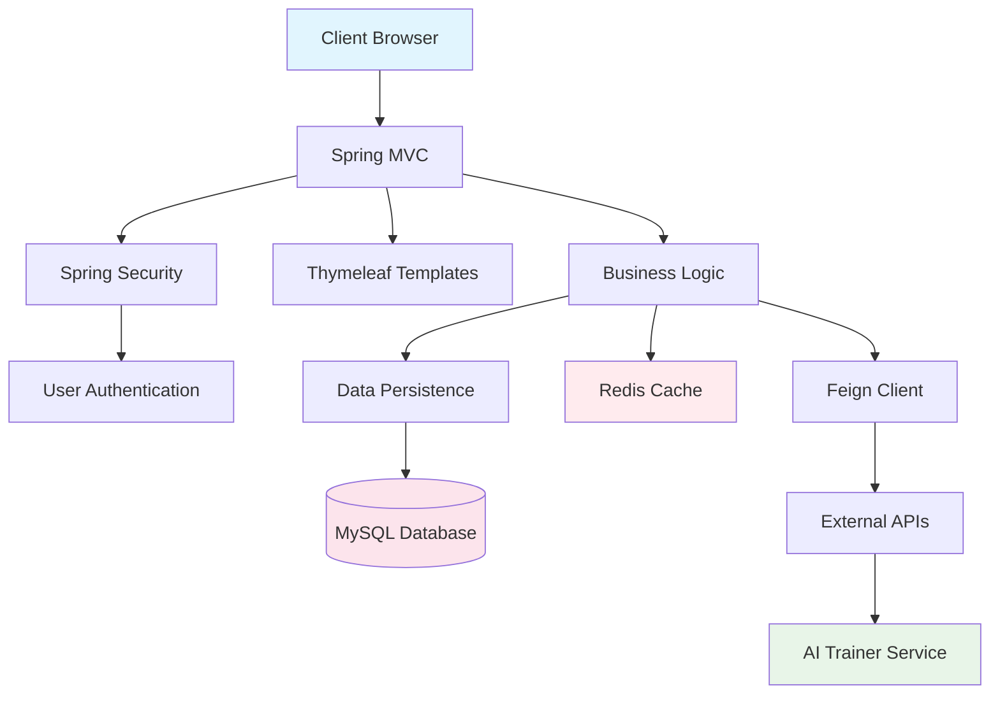

# 🏃‍♂️ RunnaLog

**RunnaLog** is a personal running log application that helps users track runs, monitor progress, and explore subscription-based features with an engaging social component.

---

## ✨ Features

### 🔐 **Account & Security**
- **User Registration & Authentication** – Secure sign-up and login
- **Role-Based Access** – Admin, Elite, and Standard user roles
- **In-App Currency System** – Earn and spend **STRIDES (STR)** for upgrades

### 🏃 **Running Features**
- **Log Runs** – Track distance, time, pace, and routes
- **View History** – Personal running log with statistics
- **Social Feed** – See other runners' activities
- **Like & Comment** – Engage with the community
- **Running Statistics** – Visualize progress over time

### 💎 **Subscription Tiers**
- **Free Tier** – Basic features
- **Elite Subscription** – Unlock premium features with STR
- **Admin Features** – Full system access
- **AI Personal Trainer** – *(Elite/Admin only)* Get custom training plans based on your preferences

### 🤖 **AI Integration**
- **Personalized Plans** – AI-generated training schedules
- **Smart Recommendations** – Based on your running history
- **Progress Analysis** – Get insights on your performance

---

## 🛠️ Tech Stack

### **Core Framework**
<p align="left">
  
  
  
</p>

### **Security & Authentication**
<p align="left">
  
  
</p>

### **Database & Persistence**
<p align="left">
  
  
  
</p>

### **Web & Frontend**
<p align="left">
  
  
  
  
</p>

### **Performance & Caching**
<p align="left">
  
  
  
</p>

### **Development Tools**
<p align="left">
  
  
  
</p>

---

## 🚀 Quick Start

### **Initial Setup**
1. **Ensure MySQL is running** on your local machine
2. **Clone and run the application**
3. **Database auto-initializes** with demo data when empty

### **Pre-loaded Accounts**
| Role | Username | Password | Features |
|------|----------|----------|----------|
| **Admin** | `Admin` | `admin1` | Full system access, AI trainer |
| **Normal User** | `User1` | `user01` | 6425 STR for subscription testing |

### **Demo Data**
- ✅ **Both users** get sample runs
- ✅ **User1 starts with 6425 STR** – test subscription upgrades
- ✅ **Social features enabled** – likes and comments

---

## 💡 Testing Highlights

### **Currency & Subscriptions**
```text
User1's Balance: 6425 STR
→ Test upgrading to Elite tier
→ Experience premium features
→ Validate currency deduction logic
```

### **Role-Based Features**
```text
Admin Account → Full control panel
Elite Subscription → AI Trainer access
Standard User → Basic features + social
```

### **Social Features**
```text
✅ Like and comment on runs
✅ View community activities  
✅ Track engagement metrics
```

---

## ⚠️ Important Notes

| Requirement | Status | Notes |
|------------|--------|-------|
| **MySQL Database** | 🔴 **Required** | Must be running before app start |
| **Auto-Initialization** | ✅ **Automatic** | Only runs on empty database |
| **Redis Cache** | ⚡ **Optional** | Enhances performance |
| **Testing Database** | 🧪 **H2** | Used for unit tests only |

---

## 📊 Architecture Overview



---

## 🎯 Project Goals

| Goal | Status | Description |
|------|--------|-------------|
| **User Engagement** | ✅ | Social features encourage activity |
| **Monetization Path** | ✅ | STR currency & subscription tiers |
| **Performance** | ✅ | Redis caching for speed |
| **Scalability** | ✅ | Microservice-ready architecture |
| **Learning Tool** | ✅ | Complete Spring Boot example |

---

<p align="center">
  <b>🏃 Start tracking your runs today with RunnaLog! 🏃‍♀️</b>
</p>
